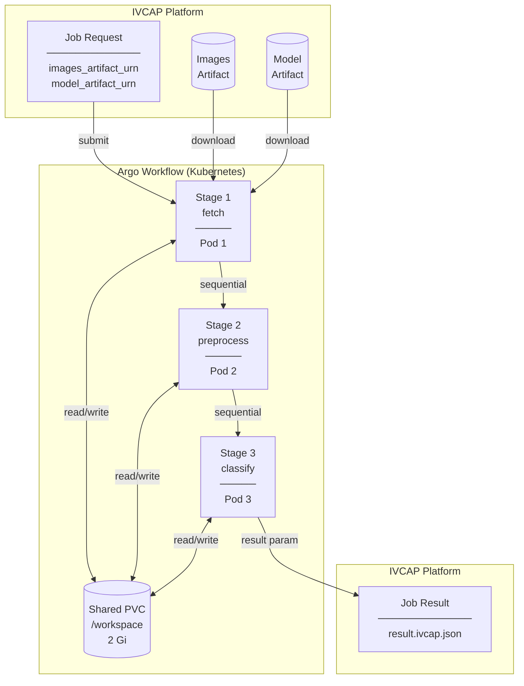
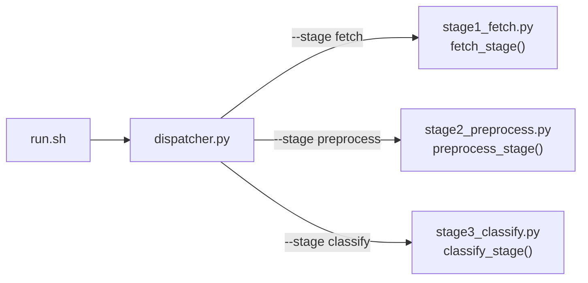
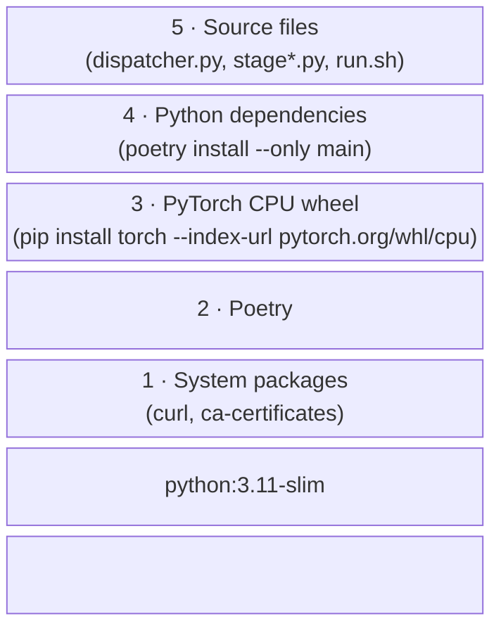
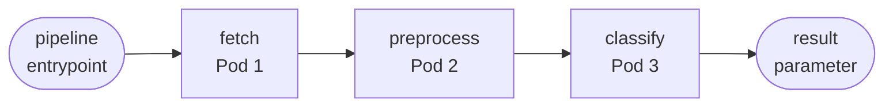
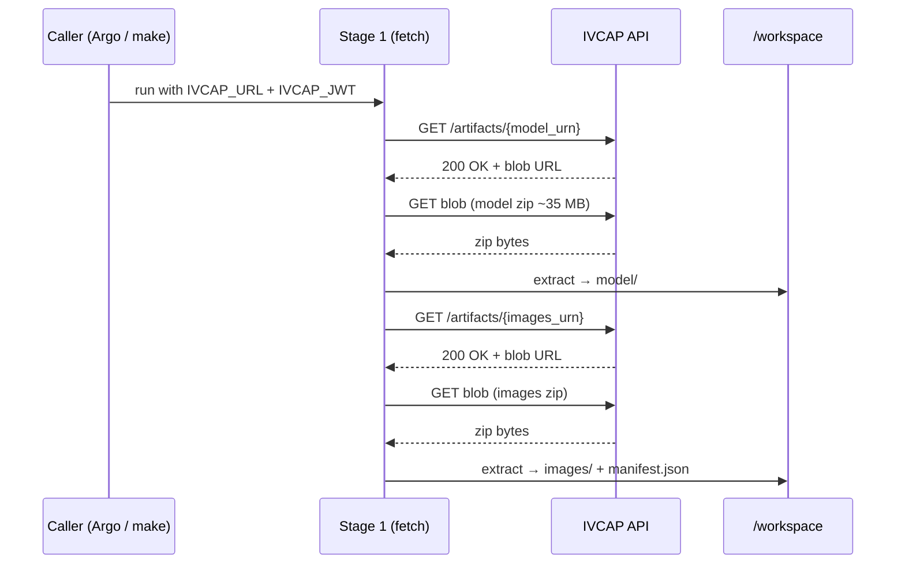

# Design & Implementation — Bird Species Classification Service

## Overview

This service classifies bird species in images using a pretrained
**EfficientNetB2** model
([dennisjooo/Birds-Classifier-EfficientNetB2](https://huggingface.co/dennisjooo/Birds-Classifier-EfficientNetB2))
via HuggingFace Transformers. It is implemented as a three-stage
**Argo Workflow** that runs inside IVCAP, with each stage executing in its
own Kubernetes pod.

The model is never baked into the Docker image. Instead, it is stored as an
IVCAP artifact and downloaded at runtime, keeping the image small and allowing
the model to be updated independently of the service code.

---

## Table of Contents

- [High-Level Architecture](#high-level-architecture)
- [Pipeline Stages](#pipeline-stages)
  - [Stage 1 — Fetch](#stage-1--fetch-stage1_fetchpy)
  - [Stage 2 — Preprocess](#stage-2--preprocess-stage2_preprocesspy)
  - [Stage 3 — Classify](#stage-3--classify-stage3_classifypy)
- [Dispatcher Pattern](#dispatcher-pattern)
- [Docker Image](#docker-image)
- [Argo Workflow](#argo-workflow-image-classify-workflowyaml)
- [IVCAP Integration](#ivcap-integration)
  - [Service Definition](#service-definition-ivcapyml)
  - [Authentication](#authentication)
- [One-Time Setup](#one-time-setup)
  - [Model Artifact](#model-artifact-make-prepare-model)
  - [Images Artifact](#images-artifact-make-prepare-data)
- [Local Development](#local-development)
- [Logging](#logging)
- [Dependencies](#dependencies)

---

## High-Level Architecture



All three stages share a single Kubernetes `PersistentVolumeClaim` (2 Gi,
`ReadWriteOnce`) mounted at `/workspace`. This avoids any need for an external
object store (S3/MinIO) for a self-contained demo.

---

## Pipeline Stages

### Stage 1 — Fetch (`stage1_fetch.py`)

**Purpose:** Download the model and images artifacts from IVCAP and extract
them to the shared workspace.

**Inputs (environment / CLI args):**

| Source | Value |
|---|---|
| `--model-artifact-urn` | URN of the EfficientNetB2 model artifact |
| `--images-artifact-urn` | URN of the bird images artifact |
| `--out-dir` | Output root directory (e.g. `/workspace/data`) |

**What it does:**
1. Uses `ivcap_client.IVCAP` (authenticating via `IVCAP_URL` + `IVCAP_JWT`
   environment variables) to download each artifact as a zip file.
2. Extracts the model zip to `<out_dir>/model/` and the images zip to
   `<out_dir>/images/`.
3. Writes `<out_dir>/manifest.json` listing all `.jpg` filenames.
4. Validates that the extracted model directory contains `config.json`,
   `preprocessor_config.json`, and at least one weight file
   (`.safetensors` or `.bin`).

**Outputs written to `<out_dir>`:**
```
model/
  config.json
  preprocessor_config.json
  model.safetensors
images/
  image_0000.jpg
  image_0001.jpg
  ...
manifest.json
```

---

### Stage 2 — Preprocess (`stage2_preprocess.py`)

**Purpose:** Normalise each image into a fixed-size float32 tensor ready for
EfficientNetB2 inference.

**What it does:**
1. Loads `EfficientNetImageProcessor` from the model directory (reads
   `preprocessor_config.json` — no internet access required).
2. For each image listed in `manifest.json`:
   - Opens the JPEG with Pillow and converts to RGB.
   - Passes it through the processor, which resizes to **260 × 260**,
     rescales pixel values, and normalises with ImageNet statistics.
   - Saves the result as a NumPy `.npy` file with shape `(1, 3, 260, 260)`
     and dtype `float32` (NCHW layout expected by PyTorch).
3. Updates `manifest.json` with a `"tensors"` key listing the `.npy` filenames.

**Outputs written to `<out_dir>`:**
```
tensors/
  image_0000.npy    # shape (1, 3, 260, 260), float32
  image_0001.npy
  ...
manifest.json       # updated with "tensors" list
```

---

### Stage 3 — Classify (`stage3_classify.py`)

**Purpose:** Run PyTorch inference and produce the final results JSON.

**What it does:**
1. Loads `EfficientNetForImageClassification` from the model directory
   (fully offline — weights come from `model.safetensors`).
2. For each tensor in `manifest.json`:
   - Loads the `.npy` file and wraps it in a `torch.Tensor`.
   - Runs a forward pass under `torch.no_grad()`.
   - Applies softmax and extracts the **top-5** predicted bird species with
     their confidence scores.
   - Logs inference time per image.
3. Writes a JSON result file with all predictions.

**Output (`result.ivcap.json`):**
```json
{
  "model": "dennisjooo/Birds-Classifier-EfficientNetB2",
  "results": [
    {
      "image": "image_0000.jpg",
      "inference_ms": 182.1,
      "top5": [
        { "rank": 1, "label": "SWINHOES PHEASANT", "score": 0.9999 },
        ...
      ]
    }
  ]
}
```

The output path is controlled by the `IVCAP_RESULT_PATH` environment variable.
In the Argo workflow this is set to `/result.ivcap.json` so Argo can read the
file after the container exits and surface it as a workflow output parameter
(picked up by the IVCAP controller from
`wf.Status.Outputs.Parameters["result"].Value`).

---

## Dispatcher Pattern

All three stages are packaged into a **single Docker image** and invoked
through a shared entrypoint:

```
run.sh  →  python dispatcher.py --stage <fetch|preprocess|classify> [args...]
```

`dispatcher.py` imports the stage functions from the individual modules and
routes the call based on `--stage`. This means:

- Only one Docker image to build, push, and maintain.
- No need for inline shell scripts or ConfigMap mounts in the Argo YAML.
- Each stage can still be invoked independently for local testing
  (e.g. `python stage1_fetch.py --help`).



---

## Docker Image

**Base image:** `python:3.11-slim`

**Key design decisions:**

| Decision | Rationale |
|---|---|
| CPU-only PyTorch wheel | Avoids pulling ~4 GB of CUDA/NVIDIA packages that are unnecessary for inference on cloud pods without GPUs |
| Poetry with `virtualenvs.create false` | Installs all packages into the system Python so `python dispatcher.py` works directly without `poetry run` |
| Model not baked in | Keeps the image small (~1.5 GB vs ~3 GB); model can be updated independently |
| `run.sh` calls `python` directly | Skips Poetry's runtime wrapper, eliminating the "Skipping virtualenv creation" startup noise |

**Build:**
```
docker build -t image-classify-app:latest .
```

**Image layers (in order):**



---

## Argo Workflow (`image-classify-workflow.yaml`)

The workflow is defined as a standard Argo `Workflow` resource with a
`steps` template that enforces strict stage ordering:



**Shared volume:** A `volumeClaimTemplate` creates a 2 Gi PVC named
`workspace`. All three pods mount it at `/workspace`.

**Resource allocations:**

| Stage | Memory request | CPU request | Memory limit | CPU limit |
|---|---|---|---|---|
| fetch | 512 Mi | 250m | 1 Gi | 500m |
| preprocess | 512 Mi | 500m | 1 Gi | 1000m |
| classify | 1 Gi | 1000m | 2 Gi | 2000m |

**Result capture:** Stage 3 writes `/result.ivcap.json`, which Argo reads
via `outputs.parameters[].valueFrom.path`. The value is propagated up to
the workflow-level outputs so the IVCAP controller can retrieve it.

---

## IVCAP Integration

### Service definition (`ivcap.yml`)

Declares the service to IVCAP using schema `urn:ivcap:schema.service.2`:

- **Service ID:** `urn:ivcap:service:7c9e66d9-74fa-4c8e-8f55-1d39b8204f14`
- **Controller:** `urn:ivcap:schema.service.argo.1` (Argo Workflow runner)
- **Request schema:** Two required string parameters:
  - `images_artifact_urn` — URN of the bird images artifact
  - `model_artifact_urn` — URN of the EfficientNetB2 model artifact

The workflow YAML is merged into the service definition at registration time
via `merge-ivcap-workflow.sh`.

### Authentication

Stages that access IVCAP read credentials from two environment variables:

| Variable | Purpose |
|---|---|
| `IVCAP_URL` | Base URL of the IVCAP API (e.g. `https://develop.ivcap.net`) |
| `IVCAP_JWT` | JWT access token for the IVCAP API |

These are injected by the Argo workflow (sourced from Kubernetes secrets) and
can be provided manually for local Docker runs via `ivcap context get url/access-token`.



---

## One-Time Setup

### Model artifact (`make prepare-model`)

Run once before the first pipeline execution:

```
make prepare-model
```

`prepare_model.py` downloads `dennisjooo/Birds-Classifier-EfficientNetB2`
from HuggingFace Hub (~35 MB), saves it with `save_pretrained`, zips the
directory, and uploads it as an IVCAP artifact. The artifact URN is recorded
in `data/model_artifact.json` and the zip file is retained in `data/` so
the Makefile can derive the URN automatically.

### Images artifact (`make prepare-data`)

Run once to upload sample bird images:

```
make prepare-data
```

`prepare_data.py` packages the JPEG images from `data/images/` into a zip
file and uploads it as an IVCAP artifact.

---

## Local Development

**Run the full pipeline in Docker (without Kubernetes):**

```bash
make docker-build   # build image
make docker-run     # run all three stages sequentially
```

`docker-run` mounts `./run` as `/workspace` and invokes one container per
stage, passing the correct `--in-dir` / `--out-dir` arguments. Results are
written to `./run/outputs/result.ivcap.json`.

**Run stages individually (without Docker):**

```bash
make run-stage1     # fetch
make run-stage2     # preprocess (requires stage 1 output)
make run-stage3     # classify   (requires stage 2 output)
make run-all        # all three
```

**Dispatcher tests:**

```bash
make test-dispatcher
```

---

## Logging

All modules use Python's standard `logging` library via a module-level logger:

```python
logger = logging.getLogger(__name__)
```

`dispatcher.py` calls `logging.basicConfig(level=..., format="%(levelname)s: %(message)s")`
before invoking any stage, so every log line from every module is uniformly
prefixed (e.g. `INFO: Stage 1 complete.`). The log level is controlled by the
`LOG_LEVEL` environment variable (default: `INFO`).

---

## Dependencies

| Package | Role |
|---|---|
| `torch` (CPU) | PyTorch inference engine |
| `transformers` | `EfficientNetForImageClassification`, `EfficientNetImageProcessor` |
| `safetensors` | Load `.safetensors` model weights |
| `Pillow` | Open and convert JPEG images |
| `numpy` | Save/load preprocessed tensors as `.npy` |
| `ivcap-client` | Download IVCAP artifacts (HTTP + JWT auth) |

Dev-only: `pytest`, `black`, `flake8`, `mypy`, `datasets`.
