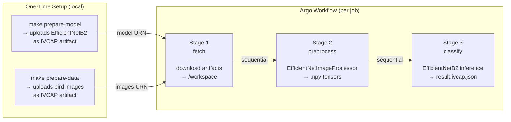

# Bird Species Classification — IVCAP Argo Workflow

A three-stage **Argo Workflow** that classifies bird species in images using a
pretrained **EfficientNetB2** model
([dennisjooo/Birds-Classifier-EfficientNetB2](https://huggingface.co/dennisjooo/Birds-Classifier-EfficientNetB2))
via HuggingFace Transformers. The model is fetched from an IVCAP artifact at
runtime — it is never baked into the Docker image.

> For a full explanation of the architecture, design decisions, and IVCAP
> integration see **[DESIGN.md](DESIGN.md)**.

---

## Table of Contents

- [Pipeline Overview](#pipeline-overview)
- [Prerequisites](#prerequisites)
- [One-Time Setup](#one-time-setup)
- [Local Development](#local-development)
  - [Build the Docker image](#build-the-docker-image)
  - [Run the full pipeline locally](#run-the-full-pipeline-locally)
  - [Run stages individually](#run-stages-individually)
- [Deploying to IVCAP / Kubernetes](#deploying-to-ivcap--kubernetes)
  - [Build and push the image](#build-and-push-the-image)
  - [Register the service](#register-the-service)
  - [Submit a job](#submit-a-job)
- [Expected Output](#expected-output)
- [Project Files](#project-files)
- [References](#references)

---

## Pipeline Overview



Each stage runs in its own Kubernetes pod and shares a 2 Gi PVC at
`/workspace`. All three stages use the **same Docker image**, routed via
`dispatcher.py --stage <fetch|preprocess|classify>`.

---

## Prerequisites

| Tool | Purpose |
|---|---|
| Python 3.11+ | Local development and setup scripts |
| [Poetry](https://python-poetry.org/) | Dependency management |
| Docker | Build and run the pipeline container |
| [IVCAP CLI](https://docs.ivcap.io/) | Upload artifacts, manage services |
| `ivcap context` configured | Provides `IVCAP_URL` and access token |

Install Python dependencies:
```bash
poetry install
```

---

## One-Time Setup

These steps are run **once** before the first pipeline execution. They download
and upload data to IVCAP as reusable artifacts.

### 1. Prepare the model artifact

Downloads EfficientNetB2 (~35 MB) from HuggingFace Hub and uploads it to IVCAP:

```bash
make prepare-model
```

The artifact URN is stored in `data/model_artifact.json` and the zip is
retained locally so the Makefile can derive the URN automatically.

### 2. Prepare the images artifact

Packages sample bird images and uploads them to IVCAP:

```bash
make prepare-data
```

After both steps, `make info` shows the artifact URNs that will be used at
runtime:

```bash
make info
```

---

## Local Development

### Build the Docker image

```bash
make docker-build
```

### Run the full pipeline locally

Runs all three stages in Docker, mounting `./run` as the shared workspace:

```bash
make docker-run
```

Results are written to `./run/outputs/result.ivcap.json`.

### Run stages individually

Without Docker (using the local Poetry environment):

```bash
make run-stage1     # Stage 1: fetch artifacts from IVCAP
make run-stage2     # Stage 2: preprocess images (requires stage 1 output)
make run-stage3     # Stage 3: classify bird species (requires stage 2 output)
make run-all        # All three stages in sequence
```

Or test the dispatcher pattern:

```bash
make test-dispatcher
```

### Other useful targets

```bash
make clean          # Remove run outputs
make clean-cache    # Remove ./data cache (model, images, zips)
make lint           # flake8
make format         # black
make test           # pytest
```

---

## Deploying to IVCAP / Kubernetes

### Build and push the image

Builds a `linux/amd64` image and pushes it to the IVCAP container registry:

```bash
make ivcap-docker-publish
```

### Register the service

Merges the Argo workflow YAML into the IVCAP service definition and registers
it:

```bash
make register-service
```

This runs `merge-ivcap-workflow.sh` to combine `ivcap.yml` with
`image-classify-workflow.yaml`, then calls `ivcap df update`.

### Submit a job

```bash
# Using ivcap-test-request.json
make ivcap-test-job

# Or via local IVCAP context
make ivcap-test-job-local
```

To submit directly with the `ivcap` CLI and switching on event streaming for immedaite feedback:

```bash
ivcap job create urn:ivcap:service:7c9e66d9-74fa-4c8e-8f55-1d39b8204f14 -f ivcap-test-request.json --stream
 ─────────
ID: 00063725 - ivcap.job.status
{
  "SeqID": "00063725",
  "eventID": "019e9188-5f48-795e-b727-9f517999674e",
  "type": "ivcap.job.status",
  "schema": "urn:ivcap:schema:job.status.1",
  "source": "controller",
  "timestamp": "2026-06-04T07:28:14.152615Z",
  "data": {
    "job-urn": "urn:ivcap:job:a2acc877-d125-47d2-8922-4ce665f044a9",
    "status": "pending"
  }
}
...
─────────
ID: 00063741 - ivcap.job.argo.phase
{
  "SeqID": "00063741",
  "eventID": "019e918a-0d95-741a-94fc-b2cdc5332528",
  "type": "ivcap.job.argo.phase",
  "source": "controller/argo",
  "timestamp": "2026-06-04T07:30:04.309272Z",
  "data": {
    "job-urn": "urn:ivcap:job:a2acc877-d125-47d2-8922-4ce665f044a9",
    "message": "a-bird-classif-4ce665f044a9-58cpw-2180853872: Pending→Running",
    "phase": "Running",
    "progress": "2/3"
  }
}
...
─────────
ID: 00063744 - ivcap.job.succeeded
{
  "SeqID": "00063744",
  "eventID": "019e918a-3622-7334-880d-cb804280dbdf",
  "type": "ivcap.job.succeeded",
  "schema": "urn:ivcap:schema:job.status.1",
  "source": "controller",
  "timestamp": "2026-06-04T07:30:14.690213Z",
  "data": {
    "job-urn": "urn:ivcap:job:a2acc877-d125-47d2-8922-4ce665f044a9",
    "status": "succeeded"
  }
}
─────────

         Name  a-bird-classif-4ce665f044a9
IVCAP Status  succeeded
       Result  urn:ivcap:aspect:1b2371c9-6aa2-44d9-be95-bbca803acdc7 (@1)
               {
                 "model": "dennisjooo/Birds-Classifier-EfficientNetB2",
                 "results": [
                   {
                     "image": "image_0000.jpg",
                     "inference_ms": 706.6,
                     "top5": [
                       {
                         "label": "SWINHOES PHEASANT",
                         "rank": 1,
               ...

           ID  urn:ivcap:job:a2acc877-d125-47d2-8922-4ce665f044a9 (@2)
   Started At  2 minutes ago (04 Jun 26 17:28 AEST)
  Finished At  4 seconds ago (04 Jun 26 17:30 AEST)
      Service  urn:ivcap:service:7c9e66d9-74fa-4c8e-8f55-1d39b8204f14 (@3)
       Policy  urn:ivcap:policy:ivcap.base.service
      Account  urn:ivcap:account:45a06508-5c3a-4678-8e6d-e6399bf27538      ```
```
---

## Expected Output

The result of the run (internally written to ivcap.result.json) contains top-5 bird species predictions per image:

```json
% ivcap df get urn:ivcap:aspect:1b2371c9-6aa2-44d9-be95-bbca803acdc7

        ID  urn:ivcap:aspect:1b2371c9-6aa2-44d9-be95-bbca803acdc7 (@1)
    Entity  urn:ivcap:job:a2acc877-d125-47d2-8922-4ce665f044a9
    Schema  urn:ivcap:schema:argo.job-result.1
  Asserter  urn:ivcap:principal:45a06508-5c3a-4678-8e6d-e6399bf27538:auth0%7C63eed6bb3b16f287edc3af41
 ValidFrom  8 minutes ago
   Content  {
              "model": "dennisjooo/Birds-Classifier-EfficientNetB2",
              "results": [
                {
                  "image": "image_0000.jpg",
                  "inference_ms": 706.6,
                  "top5": [
                    {
                      "label": "SWINHOES PHEASANT",
                      "rank": 1,
                      "score": 0.9999
                    },
                    {
                      "label": "BULWERS PHEASANT",
                      "rank": 2,
                      "score": 0.0001
                    },
                    {
                      "label": "CRESTED FIREBACK",
                      "rank": 3,
                      "score": 0
                    },
                    {
                      "label": "CRESTED WOOD PARTRIDGE",
                      "rank": 4,
                      "score": 0
                    },
                    {
                      "label": "RED LEGGED HONEYCREEPER",
                      "rank": 5,
                      "score": 0
                    }
                  ]
                },
                ...
```

---

## Project Files

| File | Purpose |
|---|---|
| `dispatcher.py` | Entry point — routes `--stage` to the correct stage function |
| `stage1_fetch.py` | Download model and images artifacts from IVCAP |
| `stage2_preprocess.py` | Preprocess images → `(1, 3, 260, 260)` float32 tensors |
| `stage3_classify.py` | Run EfficientNetB2 inference, write `result.ivcap.json` |
| `run.sh` | Thin shell wrapper: `exec python dispatcher.py "$@"` |
| `Dockerfile` | Container image definition |
| `image-classify-workflow.yaml` | Argo Workflow definition (3 stages, shared PVC) |
| `ivcap.yml` | IVCAP service definition (schema, request parameters) |
| `merge-ivcap-workflow.sh` | Merges `ivcap.yml` + workflow YAML for service registration |
| `prepare_model.py` | One-time: download EfficientNetB2 and upload as IVCAP artifact |
| `prepare_data.py` | One-time: package bird images and upload as IVCAP artifact |
| `Makefile` | Convenience targets for all common tasks |
| `DESIGN.md` | Architecture, design decisions, and detailed implementation notes |

---

## References

- [dennisjooo/Birds-Classifier-EfficientNetB2](https://huggingface.co/dennisjooo/Birds-Classifier-EfficientNetB2) — HuggingFace model
- [HuggingFace Transformers](https://huggingface.co/docs/transformers/)
- [Argo Workflows documentation](https://argoproj.github.io/argo-workflows/)
- [IVCAP documentation](https://docs.ivcap.io/)
